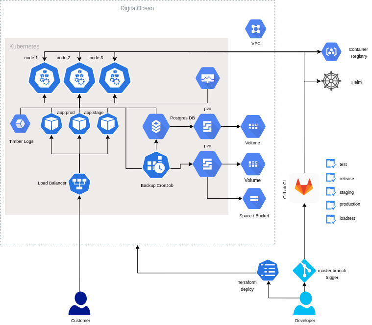

# Introduction

The repository contains a DevOps solution for initializing infrastructure and deploying a Python Flask application. I am using:

- Terraform for deploying the infrastructure on the cloud
- DigitalOcean as cloud provider
- Kubernetes as a container orchestrator
- GitHub Actions for CI/CD

# Architecture

On the image below you can see the architecture of the whole infrastructure and how the services are deployed to the cluster.

<div align="center">



</div>

# Infrastructure

As we can see on the image, Kubernetes is is the main part of the infrastructure where the application is deployed, the application is also dependent on several internal and external services, some of them are deployed directly on the cluster and some of them are launched directly on Cloud (in our case it is DigitalOcean).

The following services are launched directly on the cloud:

- Kubernetes cluster
- Bucket space
- Storage - In Kubernetes we are applying `pvc` objects (Persistent Volume Claim), it create a volume in DigitalOcean where the data is saved.

The following services are deployed inside the Kubernetes cluster:

- NGINX Ingress controller
- The `realworld` application (staging and production)
- Logging agent
- Backups

### Extra configurations in DigitalOcean

- Domains for the ingresses are custom created
- The Load Balancers in DigitalOcean are automcatically created, actually there is only one Load Balancer for the NGINX Ingress Controller

### Nginix Ingress controller

The NGINX Ingress Controller for Kubernetes provides enterprise‑grade delivery services for Kubernetes applications. With the NGINX Ingress Controller for Kubernetes, we are getting basic load balancing, SSL/TLS termination, support for URI rewrites, and upstream SSL/TLS encryption which is still not configured on the cluster. By default, pods of Kubernetes services are not accessible from the external network, but only by other pods within the Kubernetes cluster. Kubernetes has a built‑in configuration for HTTP load balancing, called Ingress, that defines rules for external connectivity to Kubernetes services and that is how we can send requests to our `Realworld` application.

### Realworld app

This is the application that I have selected for deploying on the infrastructure, it is a Python Flask application available on GitHub https://github.com/gothinkster/flask-realworld-example-app.

### Logs

Timber is a hosted service for aggregating logs across the entire stack - any language, any platform, any data source. I have chosen Timber over the other popular log aggregators because it is simple for using and it isn't taking too many resources from my cluster comparing with ELK. I am using Timber for collecting the logs from the `realworld` application which is deployed on the Kubernetes cluster. I have created a free trial account on timber.io, from the web dashboard I have created a Kubernetes `source` with generated:
- Source ID
- API Key

### Backups

I have created a custom Bash script for creating PostgreSQL dumps and uploading the .sql files to DigitalOcean Space Bucket. The script itself is dockerized and the image is maintained through GitHub Actions flow, same as the application image is maintained and pushed to Container Registry.

The container is deployed to Kubernetes through a CronJob object that is executing the script daily. The script is placed in `scripts/backup/`, the k8s files are placed in `k8s/backup`.

# Initialization

I am using Terraform for initializing the infrastructure and custom Bash scripts for one time deployments on the cluster.

### Prequsities

- Existing DigitalOcean account with created organization and available secret and access keys
- Make a copy from the .env.sample file to .env and declare the required ENV variables
- Make a copy from the .s3cfg.sample file to .s3cfg, this is the file where the credentials to DigitalOcean Space are placed. I am using `s3cmd` for pushing the backups to DigitalOcean Space Bucket

### Install

For initializing the infrastructure on DigitalOcean use:

```
make init
```

# Maintaining

There are 2 extra possibilities for scaling and destroying the cluster over Terraform, the scripts are placed in the `scripts` directory and that functionality can be called using the following `make` commands:

Manual horizontal and vertical scaling
```
make scale NODES=2 SIZE=s-2vcpu-4gb
```

Destroying the whole infrastructure
```
make destroy
```

### Docker and Helm

I wrote a Dockerfile for dockerizing the application, I put the required dependencies for making the application be ready for deploying on Kubernetes. Helm is a tool that streamlines installing and managing Kubernetes applications: 

- Helm renders the templates and communicates with the Kubernetes API
- Helm runs inside the CI/CD config
- Charts are Helm packages that contain at least two things:
    - A description of the package (Chart.yaml)
    - One or more templates, which contain Kubernetes manifest files
- Charts can be stored on disk, or fetched from remote chart repositories (like Debian or RedHat packages)

Our Helm Chart contains:

- Deployment
- Service
- Ingress

Dependencies:

- Postgres - it is only enabled for the production deployment, the staging environment uses internal sqlite database.

